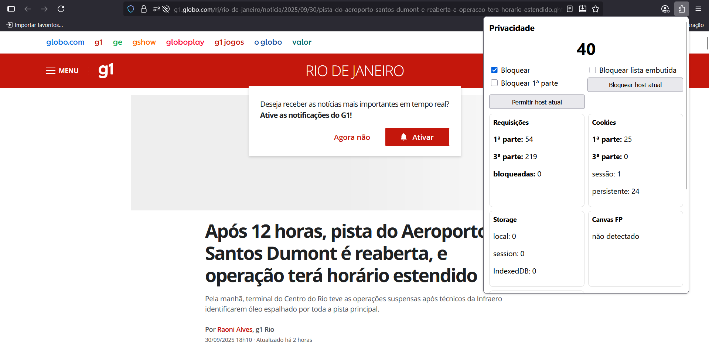
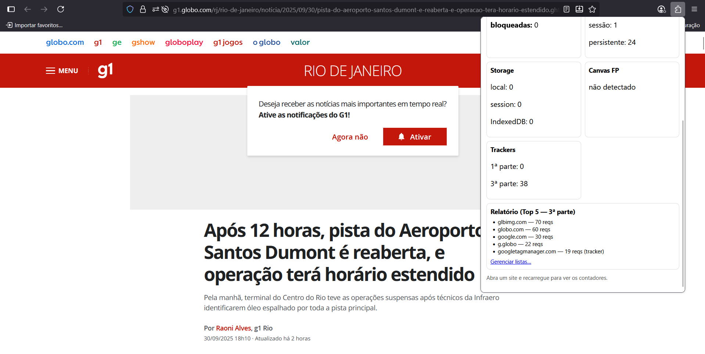

# Firefox Privacy Guard (Resumo Técnico)

Extensão para **Firefox** que detecta sinais de risco de privacidade em páginas e permite bloqueio ativo de trackers. Versão: **Conceito A** (entrega completa: requisitos C, B e A).

---

## 1) Instalação e execução (rápida)

1. Abra o Firefox e vá para `about:debugging` → **Este Firefox**.
2. **Carregar Add-on Temporário…** → selecione `plugin/manifest.json`.
3. Abra uma página (ex.: G1), pressione **F5** e clique no ícone da extensão.
4. No popup você verá score, contadores 1ª/3ª parte, cookies, storage, Canvas FP, sync, hijack, relatório Top-5 e controles de bloqueio.

---

## 2) O que foi implementado — mapping para requisitos

* **Contagem 1ª/3ª parte** por aba: `background/worker.js` (webRequest.onBeforeRequest).
* **Detecção de hijack/hook**: `content/hook-detector.js` (MutationObserver + padrões).
* **Medição de storage**: `content/detector.js` (localStorage, sessionStorage, IndexedDB).
* **Cookies**: leitura por `domain` + `storeId` (Firefox) e classificação 1ª/3ª, sessão/persistente (`background/worker.js`).
* **Canvas fingerprint**: intercepta `.toDataURL()`, `.toBlob()` e `getImageData()` em `content/canvas-patch.js`.
* **Cookie-sync**: heurística por parâmetros comuns (`_ga`, `uid`, `cid`, `fbp`, etc.) e contagem de pares.
* **Relatório Top-5** por aba com marcação `(tracker)` e `[bloqueado]`.
* **Bloqueio**: cancelamento via `return { cancel: true }` em `webRequest` com allow/block lists e toggles.
* **Score (0–100)**: agregador em `shared/utils.js::computeScore(metrics)` — ajustável.

---

## 3) Estrutura do repositório (conforme sua captura)

```
plugin/
├─ assets/
│  ├─ icon.png
│  ├─ print1.png
│  └─ print2.png
├─ background/
│  └─ worker.js
├─ content/
│  ├─ canvas-patch.js
│  ├─ detector.js
│  └─ hook-detector.js
├─ options/
│  ├─ options.html
│  └─ options.js
├─ popup/
│  ├─ popup.html
│  ├─ popup.css
│  └─ popup.js
├─ shared/
│  ├─ trackers.json
│  └─ utils.js
└─ manifest.json
```

---

## 4) Metodologia do score (resumo)

* Parte inicial: **100 pontos**.
* Penalidades (exemplos/valores default):

  * Requisições 3ª parte: −2 por request (cap −30).
  * Cookies 3ª parte: −2 por cookie (cap −20).
  * Storage (local/session/IndexedDB): −5 cada.
  * Canvas FP: −15.
  * Cookie-sync: −5 por par.
  * Hijack/Hook: −15 por flag.
* Bônus por mitigação: +0.2 por requisição bloqueada (até +20).
* Ajuste: editar `shared/utils.js::computeScore()`.

---

## 5) Configuração e personalização

* **Popup**: toggles para `Bloquear`, `Bloquear lista embutida`, `Bloquear 1ª parte`; botões para adicionar host atual à Blocklist/Allowlist.
* **Opções**: pagina `options/options.html` para editar Allowlist / Blocklist (persistência em `browser.storage.local`).
* Alterações aplicam-se imediatamente.

---

## 6) Como testar (casos práticos)

* **Portal de notícias (G1)**: espere 3ª-partes numerosas; ative *Bloquear* e observe `bloqueadas` e rótulos `[bloqueado]`.
* **App web logado**: valide cookies persistentes e storage.
* **Canvas FP**: execute snippet no console (veja seção de demonstração no código) e confirme flag no popup.
* **Cookie-sync**: navegue por páginas que propagam IDs nas URLs para ver pares contabilizados.

---

## 7) Limitações conhecidas

* **eTLD+1 simplificado** (não usa PSL) — pode errar em domínios complexos (`co.uk`).
* **Heurísticas** (hijack, cookie-sync) podem produzir falsos positivos/negativos.
* **Lista embutida** é curta; produzir cobertura real exige listas públicas (ex.: EasyPrivacy).
* Em **Chromium** a estratégia de bloqueio precisaria migrar para `declarativeNetRequest`.

---

## 8) Checklist (status — o que foi entregue)

**Conceito C (base)**

* [x] Contagem 1p/3p por aba
* [x] Detecção de hijack/hook
* [x] Medição de storage (local/session/IndexedDB)
* [x] Coleta e classificação de cookies (1p/3p, sessão/persistente)
* [x] Detecção de canvas FP
* [x] Score com metodologia

**Conceito B (UI/Listas)**

* [x] Allowlist / Blocklist na página de opções
* [x] Relatório Top-5 no popup (indica trackers)

**Conceito A (bloqueio & personalização)**

* [x] Bloqueio via `webRequest` (blocking) conforme listas/toggles
* [x] Toggles + botões para host atual
* [x] Relatório de bloqueadas e distinção trackers 1p/3p

---

## 9) Troubleshooting rápido

* Extensão temporária some ao fechar Firefox — recarregar via `about:debugging`.
* Se cookies aparecem `0`: recarregue a aba; Firefox usa `getAll({domain, storeId})`.
* Se métricas acumulam entre sites: background reseta ao detectar `changeInfo.url`.
* Se popup não atualiza: abra o painel de console do popup ou recarregue a extensão e a aba.

---

## 10) Privacidade & segurança

* **Executa localmente** — não transmite os dados a servidores externos.
* Exibe apenas métricas agregadas por aba.
* Listas e configurações ficam no `browser.storage.local` do usuário.

---

## 11) Evidências (prints)

> Capturas do popup em G1 com bloqueio ativo (3ª-partes, cookies, storage, canvas FP, cookie-sync, hijack e relatório Top-5).


> 
> 
> 
> 

